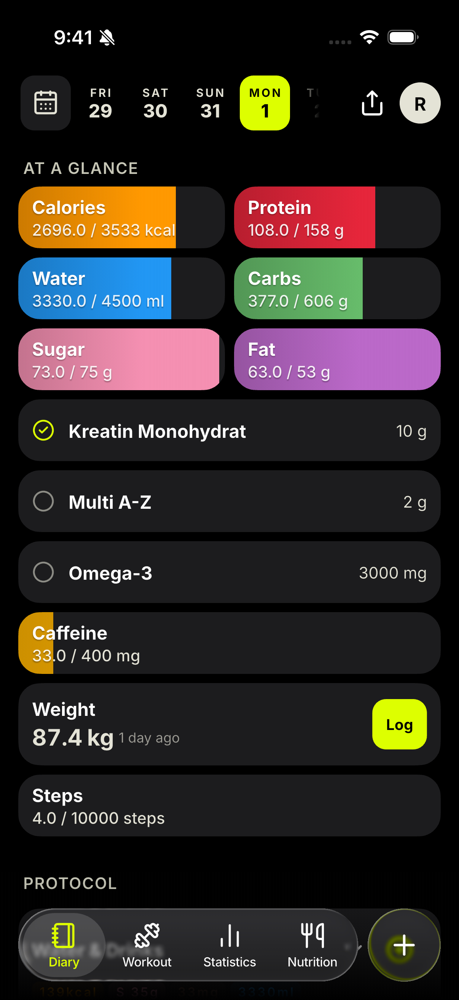
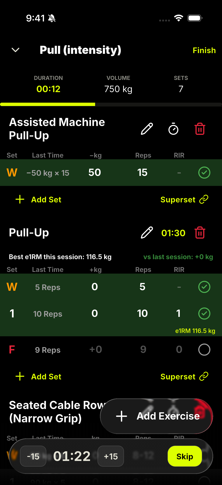
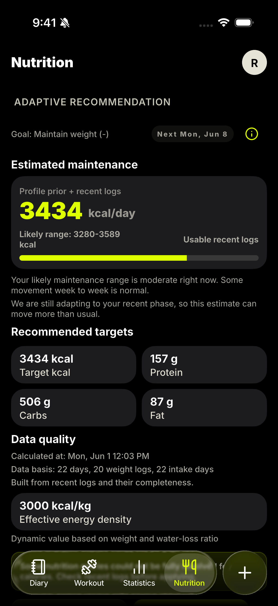
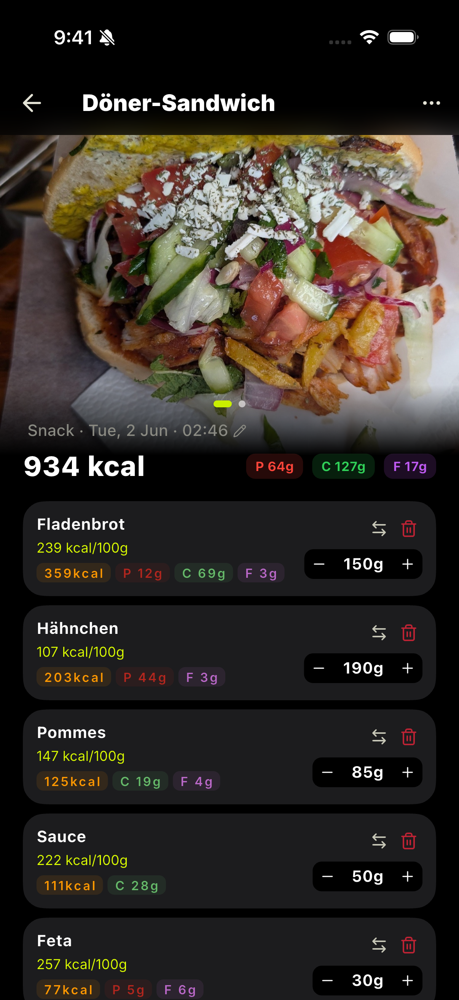
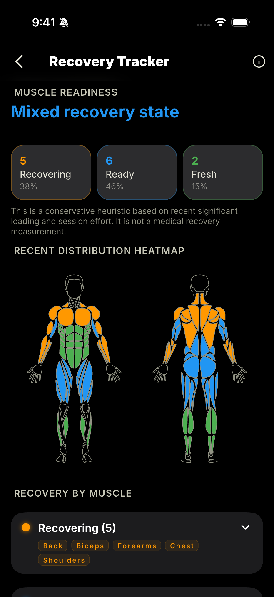
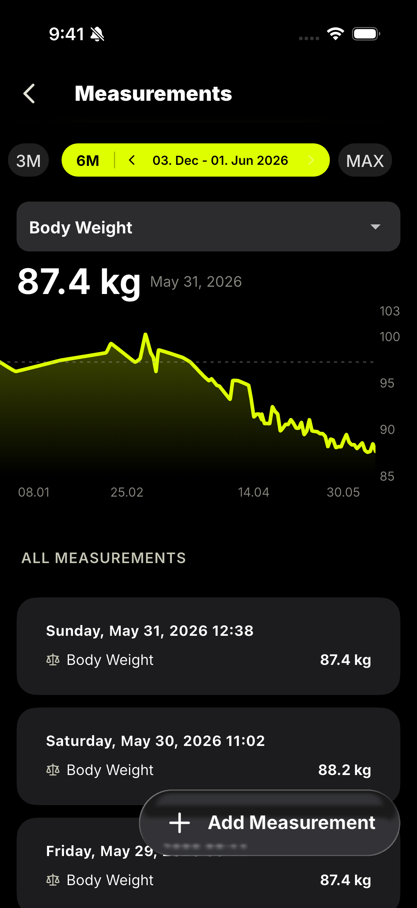
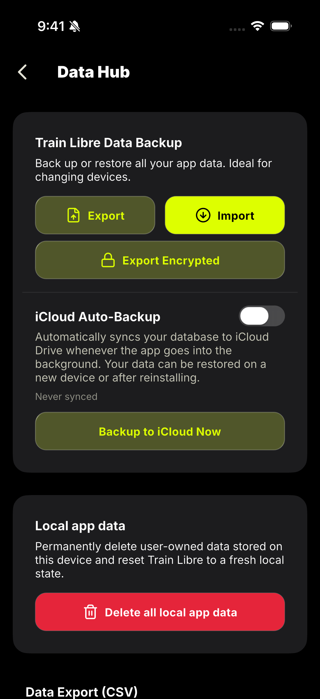

# Train Libre

**Private workout and nutrition tracking for Android and iOS.**

  
  
  
  
  

  
  
  
  

 

Train Libre is an open-source, offline-first fitness app for logging workouts, calories, macros, bodyweight, and recovery — without ads, mandatory accounts, or commercial tracking.

Designed for people who want serious tracking without social feeds, gamification, or subscription pressure, Train Libre prioritizes **privacy**, **local data ownership**, and **transparent analytics**.

### Screenshots

  <table>
    <tr>
      <td width="24%" align="center">
         
        <b>Diary</b>
      </td>
      <td width="24%" align="center">
         
        <b>Workout</b>
      </td>
      <td width="24%" align="center">
         
        <b>Nutrition</b>
      </td>
      <td width="24%" align="center">
         
        <b>AI Meal Capture</b>
      </td>
    </tr>
    <tr>
      <td width="24%" align="center">
         
        <b>Recovery</b>
      </td>
      <td width="24%" align="center">
         
        <b>Measurements</b>
      </td>
      <td width="24%" align="center">
         
        <b>Data Insights</b>
      </td>
      <td width="24%"></td>
    </tr>
  </table>

## Download & Install

<table align="center">
  <tr>
    <td align="center" valign="middle" width="250">
      
       <b>App Store Release</b>
    </td>
    <td width="30"></td>
    <td align="center" valign="middle" width="250">
      
       <b>Android (via Obtainium)</b>
    </td>
    <td width="30"></td>
    <td align="center" valign="middle" width="250">
      
       <b>Android (via F-Droid)</b>
    </td>
  </tr>
</table>

*Google Play release is currently not available.*

## Platform Support

Train Libre is built with Flutter and supports:
- **iOS** (Active)
- **Android** (Active)

## Key Features

- **Workout Tracker:** Log sets (warm-up, failure, dropsets), routines, and session history.
- **Calorie & Macro Tracker:** Track nutrition, hydration, and supplements with adaptive weekly guidance.
- **Bodyweight & Recovery Analytics:** Deep insights into muscle readiness, volume trends, and body measurements.
- **Sleep & Vitals:** Sleep Health Score across five domains, plus steps and heart-rate aggregates imported from Apple Health or Health Connect.
- **Next-Gen AI Meal Capture:** Capture meals from photos or text via BYOK (Bring Your Own Key) setup. Fully integrated with a holistic culinary anchor (`mealContext`) and a state-aware "Top-N Fuzzy Alternatives" SQLite matching system that prevents hallucinations. Always reviewable and self-repairing before saving.
- **Privacy & Local-First:** Data stays on device. Optional one-way health export to Apple Health and Google Health Connect.

## Privacy & Philosophy

- **No Ads. No Mandatory Account. No Commercial Tracking (Optional Pseudonymised Usage Statistics, off by default).**
- **Offline-First:** Your data stays local unless you explicitly choose otherwise.
- **Open-Source Transparency:** Trust through public code and understandable data flows.
- **User-Controlled AI:** Optional AI features require your own API key; no data is sent to providers without opt-in.

## Documentation

This project features a comprehensive, modular documentation suite split by target audience and component. Use the links below to access the technical resources:

### Developer Resources
*   [Developer Overview](documentation/developer/overview.md): Technical vision, key architectural pillars, technology stack, and testing philosophy.
*   [Architecture & SQLite Lifecycle](documentation/developer/architecture.md): Clean Architecture layering and database connection lifecycle pattern.
*   [Data Flow & State Lifecycle](documentation/developer/data_flow_and_state.md): Reactive reads, imperative writes, subscription cancellation, and UI concurrency guards.
*   [Localization Architecture](documentation/developer/localization_architecture.md): Offline-first relational localization and the guide for adding a new locale.

### Advanced Features & Algorithmic Transparency
*   [Smart Features Overview](documentation/features/overview.md): Overview of algorithmic features and architectural privacy invariants.
*   [Bayesian TDEE Estimator](documentation/features/bayesian_tdee_estimator.md): Comprehensive mathematical and statistical formulation of the Kalman filter-based adaptive energy expenditure engine.
*   [BYOK AI Meal Validation](documentation/features/byok_ai_validation.md): AI meal capture pipeline details, fuzzy validation scoring, and the 3-pass self-repair verification loop.
*   [**Native Health Sync & Export**](documentation/features/health_sync_export.md): Bidirectional vital synchronization (Steps, Sleep), outbound manual log export pipelines, SQLite-backed idempotency tracking, and fault-tolerance patterns.
*   [Sleep Health Score Engine](documentation/features/sleep_scoring_engine.md): The five scoring domains, their curve shapes, and the soft-cap penalty logic.
*   [Muscle Recovery & Fatigue Model](documentation/features/muscle_recovery_model.md): Volume-based recovery windows and intensity-driven fatigue extension per muscle.
*   [Estimated 1-Rep Max Heuristic](documentation/features/intelligent_workouts.md): The Epley-based submaximal strength model behind PRs and progression.
*   [Telemetry & Privacy Architecture](TELEMETRY.md): The complete opt-in telemetry event catalog and the anti-profiling safeguards around it.

For the full interlinked documentation map, see the main [Documentation Entry Point](documentation/README.md).

## Roadmap

The long-term vision, future modules, and planned features are maintained in the [ROADMAP.md](ROADMAP.md) file.

## Star history
<picture>
  <source media="(prefers-color-scheme: dark)" srcset="https://api.star-history.com/chart?repos=rfivesix/train-libre&style=landscape1&theme=dark" />
  <source media="(prefers-color-scheme: light)" srcset="https://api.star-history.com/chart?repos=rfivesix/train-libre&style=landscape1" />
  
</picture>

<picture>
  <source media="(prefers-color-scheme: dark)" srcset="https://api.star-history.com/chart?repos=rfivesix/train-libre&type=date&theme=dark&legend=top-left" />
  <source media="(prefers-color-scheme: light)" srcset="https://api.star-history.com/chart?repos=rfivesix/train-libre&type=date&legend=top-left" />
  
</picture>

## Credits

- **[Open Food Facts](https://openfoodfacts.org/)** for food database coverage.
- **[wger](https://github.com/wger-project/wger)** for the workout database foundation.

## License

[GPL-3.0](LICENSE)
