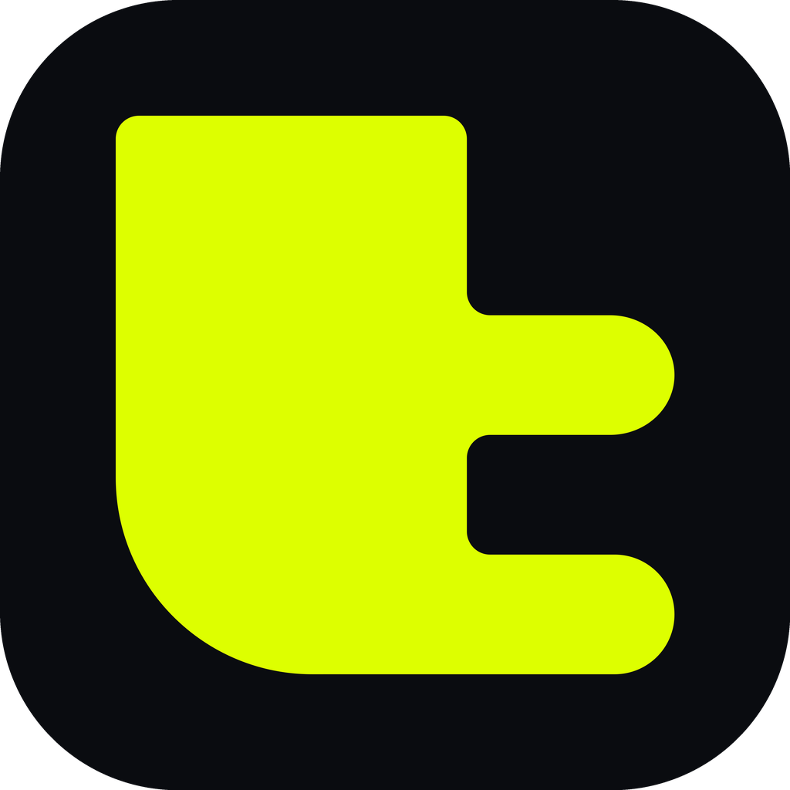
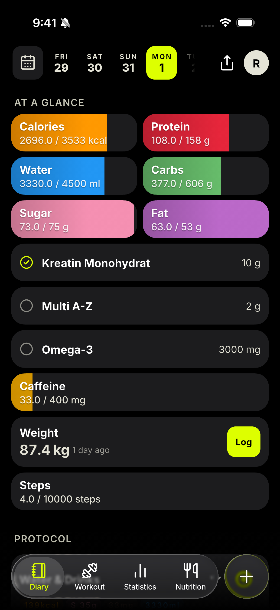
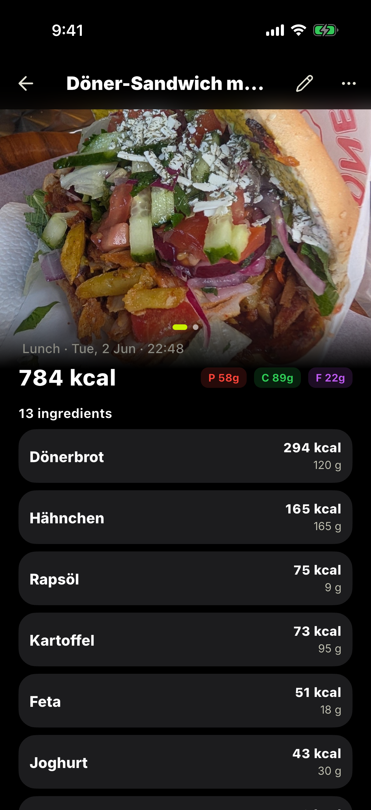
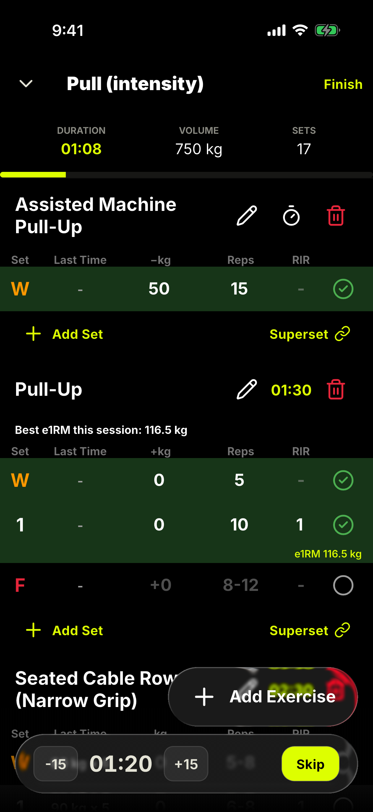
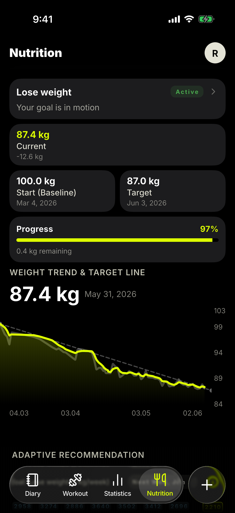
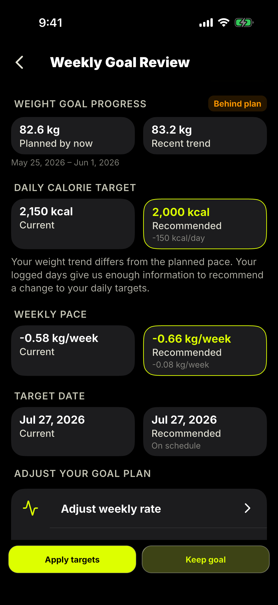
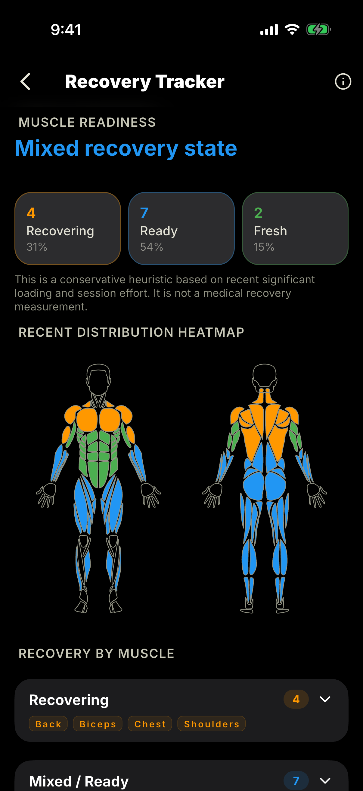
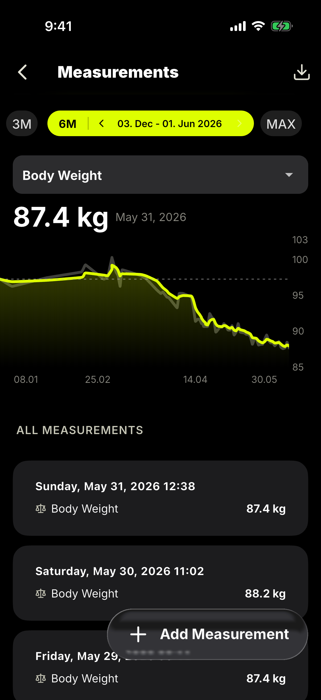
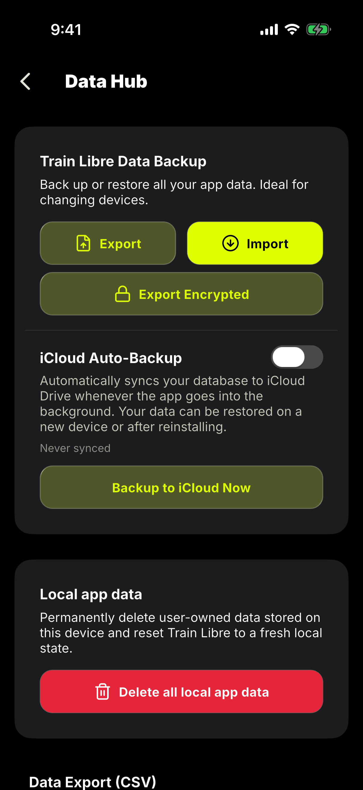

  

  <h1>Train Libre</h1>

  
<b>Private workout and nutrition tracking for Android and iOS.</b>

  

    
    
    
    
    
  

  

    
    
    
    
  

 

Train Libre is an open-source, offline-first strength training and fitness app for logging workouts, routines, calories, macros, bodyweight, and recovery — without ads, mandatory accounts, or commercial tracking.

Designed for lifters and health-conscious users who want serious tracking without social feeds, gamification, or subscription pressure, Train Libre prioritizes **privacy**, **local data ownership**, and **transparent analytics**.

### Screenshots

  <table>
    <tr>
      <td width="24%" align="center">
         
        <b>Diary</b>
      </td>
      <td width="24%" align="center">
         
        <b>AI Meal Capture</b>
      </td>
      <td width="24%" align="center">
         
        <b>Workout</b>
      </td>
      <td width="24%" align="center">
         
        <b>Nutrition</b>
      </td>
    </tr>
    <tr>
      <td width="24%" align="center">
         
        <b>Goal Review</b>
      </td>
      <td width="24%" align="center">
         
        <b>Recovery</b>
      </td>
      <td width="24%" align="center">
         
        <b>Measurements</b>
      </td>
      <td width="24%" align="center">
         
        <b>Data Insights</b>
      </td>
    </tr>
  </table>

## Download & Install

<table align="center">
  <tr>
    <td align="center" valign="middle" width="250">
      
       <b>App Store Release</b>
    </td>
    <td width="30"></td>
    <td align="center" valign="middle" width="250">
      
       <b>Android (via Obtainium)</b>
    </td>
    <td width="30"></td>
    <td align="center" valign="middle" width="250">
      
       <b>Android (via F-Droid)</b>
    </td>
  </tr>
</table>

*Google Play release is currently not available.*

## Platform Support

Train Libre is built with Flutter and natively supports:
- **iOS** (Active — Available on App Store)
- **Android** (Active — Available via Obtainium & F-Droid)

## Key Features

- **Workout & Routine Tracker (Hypertrophy & Strength):** Built for progressive overload, bodybuilding, and serious lifting. Create saved workout templates, customizable routines, and flexible training splits (PPL, Upper/Lower, Full Body). Log sets with warm-ups, working sets, failure sets, dropsets, timed sets, and RIR (Reps in Reserve) alongside rest timers and live session tracking.
- **400+ Offline Exercise Library:** Bundled offline exercise database derived from [OpenExerciseDB](https://github.com/rfivesix/OpenExerciseDB) and wger. Filter by primary and secondary muscle groups, equipment, and movement patterns, or create custom exercises.
- **Progress Tracking & Analytics:** Real-time personal record (PR) detection, estimated 1-Rep Max (1RM) progression curves (Brzycki model), volume load trends per muscle group, and comprehensive body measurement tracking (arms, chest, waist, hips, calves, thighs) with trend smoothing.
- **Wearable & Health Sync:** Native bi-directional sync with **Apple Health** (iOS) and **Health Connect** (Android) for daily steps, sleep stages, active and resting heart rate aggregates, and body weight, backed by an idempotent local export pipeline.
- **Muscle Recovery & Readiness:** Per-set RIR-aware residual load model with muscle-specific recovery decay and readiness heatmaps, paired with an algorithmic Sleep Health Score across five domains.
- **Calorie & Macro Tracker:** Track nutrition, hydration, caffeine, creatine, and custom supplements in one unified local diary with adaptive weekly guidance and a Bayesian TDEE Estimator.
- **Meal Logging, Four Ways:** Barcode scanning, offline food catalog search, saved meal templates, or the camera — barcodes are detected passively while the meal camera is open, so there is no mode to pick in advance.
- **Next-Gen AI Meal Capture:** Capture meals from photos, dictated speech, or text via BYOK (Bring Your Own Key) setup. Fully integrated with a holistic culinary anchor (`mealContext`) and a state-aware "Top-N Fuzzy Alternatives" SQLite matching system that prevents hallucinations. Always reviewable and self-repairing before saving. Self-hosted Ollama and any OpenAI-compatible endpoint are supported alongside commercial providers.
- **LiDAR Scale Hint:** On supported iPhones, a measured physical scale of the scene assists the model instead of a guessed plate size — tackling the largest source of portion estimation error. Switchable and silently skipped everywhere else.
- **Privacy & Local-First:** 100% offline-first architecture. All data stays securely on your device. No ads, no commercial tracking, and no mandatory cloud accounts.

## Privacy & Philosophy

- **No Ads. No Mandatory Account. No Commercial Tracking (Optional Pseudonymised Usage Statistics, off by default).**
- **Offline-First:** Your data stays local unless you explicitly choose otherwise.
- **Open-Source Transparency:** Trust through public code and understandable data flows.
- **User-Controlled AI:** Optional AI features require your own API key; no data is sent to providers without opt-in.

## Documentation

This project features a comprehensive, modular documentation suite split by target audience and component. Use the links below to access the technical resources:

### Developer Resources
*   [Developer Overview](documentation/developer/overview.md): Technical vision, key architectural pillars, technology stack, and testing philosophy.
*   [Architecture & SQLite Lifecycle](documentation/developer/architecture.md): Clean Architecture layering and database connection lifecycle pattern.
*   [Data Flow & State Lifecycle](documentation/developer/data_flow_and_state.md): Reactive reads, imperative writes, subscription cancellation, and UI concurrency guards.
*   [Localization Architecture](documentation/developer/localization_architecture.md): Offline-first relational localization and the guide for adding a new locale.
*   [iOS Home Screen Widgets](documentation/developer/ios_home_screen_widgets.md): The widget family, their configuration, data flow, and implementation notes.

### Advanced Features & Algorithmic Transparency
*   [Smart Features Overview](documentation/features/overview.md): Overview of algorithmic features and architectural privacy invariants.
*   [Bayesian TDEE Estimator](documentation/features/bayesian_tdee_estimator.md): Comprehensive mathematical and statistical formulation of the Kalman filter-based adaptive energy expenditure engine.
*   [BYOK AI Meal Validation](documentation/features/byok_ai_validation.md): AI meal capture pipeline details, fuzzy validation scoring, and the 3-pass self-repair verification loop.
*   [Meal Capture Pipeline](documentation/features/meal_capture_pipeline.md): Unified camera and passive barcode detection, voice dictation, meals as logged events, photo storage, and what leaves the device on each capture path.
*   [Depth Scale Hint (LiDAR)](documentation/features/depth_scale_hint.md): Measured scale facts and the optional depth image, the quality gate that discards untrustworthy measurements, and the explicit non-goals.
*   [**Native Health Sync & Export**](documentation/features/health_sync_export.md): Bidirectional vital synchronization (Steps, Sleep), outbound manual log export pipelines, SQLite-backed idempotency tracking, and fault-tolerance patterns.
*   [Sleep Health Score Engine](documentation/features/sleep_scoring_engine.md): The five scoring domains, their curve shapes, and the soft-cap penalty logic.
*   [Muscle Recovery & Readiness Model](documentation/features/muscle_recovery_model.md): Per-set RIR-aware residual load, role-weighted exposure, muscle-specific decay, and readiness.
*   [Estimated 1-Rep Max Heuristic](documentation/features/intelligent_workouts.md): The Brzycki-based submaximal strength model behind PRs and progression.
*   [Adaptive Nutrition Goals](documentation/features/adaptive_nutrition_goals.md): Long-term weight goals, weekly reviews, and proposed calorie and macro adjustments.
*   [Manual Workout Plans](documentation/features/manual_workout_plans.md): Fixed weekly plans and flexible sequences with rest days and planned-session tracking.
*   [Macronutrient Analytics](documentation/features/macro_analytics.md): Calorie and macro intake trends across selectable time ranges.
*   [Live Activity & Workout Session](documentation/features/live_activity_workout.md): The iOS Live Activity and Dynamic Island surface for a running workout.
*   [Telemetry & Privacy Architecture](TELEMETRY.md): The complete opt-in telemetry event catalog and the anti-profiling safeguards around it.

For the full interlinked documentation map, see the main [Documentation Entry Point](documentation/README.md).

## Roadmap

The long-term vision, future modules, and planned features are maintained in the [ROADMAP.md](ROADMAP.md) file.

## Star history
<a href="https://www.star-history.com/?repos=rfivesix%2Ftrain-libre&type=date&legend=top-left">
 <picture>
   <source media="(prefers-color-scheme: dark)" srcset="https://api.star-history.com/chart?repos=rfivesix/train-libre&type=date&theme=dark&legend=top-left&sealed_token=uCVD0jnyfrvzC_57pRktWEv0SpKUe4VNur4zd9E3wQ7YcN2pCR_Ht8P12saj1W0LcF5WhxY4Im2Xh2nwL6nsGkoRtL3gbZmvMLCpYsJV9DSJDQLjyFT4hKgjHduLNHyXCO6ly3W4yTpRhNpdCyMeqNAS3BXWw0tkdmOdoagdmQoHAKTfcTWu9gaH-arX" />
   <source media="(prefers-color-scheme: light)" srcset="https://api.star-history.com/chart?repos=rfivesix/train-libre&type=date&legend=top-left&sealed_token=uCVD0jnyfrvzC_57pRktWEv0SpKUe4VNur4zd9E3wQ7YcN2pCR_Ht8P12saj1W0LcF5WhxY4Im2Xh2nwL6nsGkoRtL3gbZmvMLCpYsJV9DSJDQLjyFT4hKgjHduLNHyXCO6ly3W4yTpRhNpdCyMeqNAS3BXWw0tkdmOdoagdmQoHAKTfcTWu9gaH-arX" />
   
 </picture>
</a>

## Credits

- **[Open Food Facts](https://openfoodfacts.org/)** for food database coverage.
- **[OpenExerciseDB](https://github.com/rfivesix/OpenExerciseDB)** for the exercise catalog.
- **[wger](https://github.com/wger-project/wger)** for the upstream exercise data OpenExerciseDB was built from.

## License

The application is licensed under [GPL-3.0](LICENSE).

The bundled exercise catalog is not. Exercise data comes from
[OpenExerciseDB](https://github.com/rfivesix/OpenExerciseDB), licensed under
[CC BY-SA 4.0](https://creativecommons.org/licenses/by-sa/4.0/), derived in part
from the [wger project](https://wger.de). Individual records keep their original
upstream licence and author, listed in
[ATTRIBUTION.md](https://github.com/rfivesix/OpenExerciseDB/blob/main/ATTRIBUTION.md).

ShareAlike travels with the data, not with this repository's code: redistributing
the catalog — or a database derived from it — means passing on the same licence
and the same credit. Food data from Open Food Facts is separately licensed under
the [ODbL](https://opendatacommons.org/licenses/odbl/).
