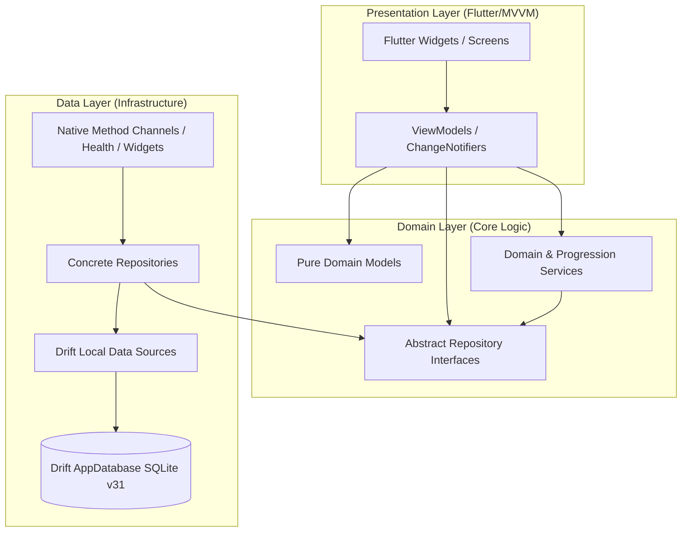

# System Architecture & SQLite Lifecycle

Train Libre strictly adheres to the principles of **Clean Architecture**. This segregation ensures that business logic remains highly testable, independent of the user interface framework, and decoupled from raw persistence mechanisms.

---

## Architectural Layering

The codebase is segregated into three distinct conceptual layers, with dependencies flowing inward toward the Domain layer.



### 1. Presentation Layer (Flutter & MVVM)
*   **Role**: Handles user interaction, responsive layouts, animations, and input collection.
*   **Components**: Flutter screens, custom widgets, and ViewModels (extending `ChangeNotifier`).
*   **Dependency Rule**: ViewModels depend strictly on abstract repository interfaces (`IDiaryRepository`, `IWorkoutRepository`, `IExerciseCatalogRepository`, `IProfileRepository`, `SupplementRepository`) or focused domain services injected via Provider. They possess no direct knowledge of Drift queries, file systems, or API endpoints.

### 2. Domain Layer (Inward Layer)
*   **Role**: The heart of the application containing pure business rules, algorithmic engines, and data contracts.
*   **Components**: Pure data models (e.g., `FoodItem`, `FoodEntry`, `MeasurementSession`, `Supplement`), abstract repository interfaces, and computational domain services (e.g., `WorkoutProgressionService`, `BayesianTdeeEstimator`, `SleepScoringEngine`).
*   **Dependency Rule**: Highly decoupled. It depends on no UI framework or data-layer implementations.

### 3. Data Layer (Outward Layer)
*   **Role**: Handles raw SQLite persistence via Drift, file caching (`AppMediaStore`, `MealPhotoStore`), hardware-backed secure storage (`FlutterSecureStorage`), and native platform communication (HealthKit, Health Connect, Home Screen Widgets).
*   **Components**: Concrete repository implementations (e.g., `WorkoutRepository`, `NutritionRepository`, `SupplementRepositoryImpl`), specialized Drift Local Data Sources (`DiaryLocalDataSource`, `WorkoutLocalDataSource`, `StepsLocalDataSource`, etc.), and `DatabaseHelper`.
*   **Dependency Rule**: Translates domain-specific requests into database transactions, queries, or channel calls.

---

## Runtime Bootstrap & Dependency Wiring (`lib/main.dart`)

At runtime, the application bootstraps and binds dependencies imperatively in `lib/main.dart` before rendering the root widget tree.

### 1. Cold-Start Initialization Sequence
1.  **Flutter Bindings & Orientation**: Invokes `WidgetsFlutterBinding.ensureInitialized()` and locks orientation to portrait.
2.  **Telemetry & Tracing**:
    *   Opens `StartupTrace.instance.beginColdStart()` and attaches listeners to measure cold start milestones.
    *   Starts `JankRecorder.instance` with `StallTelemetryReporter` to detect UI frame stalls (dropped frames). If the user is opted out of telemetry, tracking dispatches are no-ops.
3.  **Visual Pipelines & Formatters**:
    *   Initializes `LiquidGlassWidgets` shaders.
    *   Executes `initializeDateFormatting()` to avoid `LocaleDataException` across international locales.
    *   Initializes `MealPhotoStore.instance` to synchronously resolve relative photo paths.
4.  **Security Migration**: Runs `AiService.migrateSecureStorageToDeviceOnly()`, migrating legacy Keychain entries to hardware-backed device-only accessibility.
5.  **Consent & Legal Version Check**: Checks `SharedPreferences` for onboarding consent and legal version agreement (`acceptedLegalVersion`).

### 2. Database & Data Source Assembly
The main isolate creates one `AppDatabase` instance and registers it with
`DatabaseHelper` before wiring modular data sources. Other isolates, such as
the Workmanager callback, create and register their own short-lived instance.
```dart
final database = db.AppDatabase();
DatabaseHelper.setDriftDb(database);

final diaryLocalDataSource = DiaryLocalDataSource(database);
final workoutLocalDataSource = WorkoutLocalDataSource(database);
final exerciseCatalogLocalDataSource = ExerciseCatalogLocalDataSource(database);
final profileLocalDataSource = ProfileLocalDataSource(database);
final supplementLocalDataSource = SupplementLocalDataSource(database);
```

### 3. Repository & Service Assembly
Concrete repositories implement domain interfaces and wrap their respective data sources:
```dart
final workoutRepository = WorkoutRepository(localDataSource: workoutLocalDataSource);
final nutritionRepository = NutritionRepository(localDataSource: diaryLocalDataSource);
final supplementRepository = SupplementRepositoryImpl(localDataSource: supplementLocalDataSource);
final exerciseCatalogRepository = ExerciseCatalogRepository(localDataSource: exerciseCatalogLocalDataSource);
final profileRepository = ProfileRepository(localDataSource: profileLocalDataSource);

final unitService = UnitService();
final themeService = ThemeService();
final experienceLevelService = ExperienceLevelService();
final trainingAutonomyService = TrainingAutonomyService(database);
await trainingAutonomyService.initialize();

final workoutProgressionService = WorkoutProgressionService(
  repository: workoutRepository,
  unitService: unitService,
);

final workoutSessionManager = LiveWorkoutViewModel(
  repository: workoutRepository,
  unitService: unitService,
  progressionService: workoutProgressionService,
  trainingAutonomyService: trainingAutonomyService,
);
```

### 4. Provider Dependency Injection Tree
A top-level `MultiProvider` registers dependencies so child widgets access them via `context.read<T>()` or `context.watch<T>()`:
*   `Provider<IDiaryRepository>.value(...)`
*   `Provider<IWorkoutRepository>.value(...)`
*   `Provider<SupplementRepository>.value(...)`
*   `Provider<IExerciseCatalogRepository>.value(...)`
*   `Provider<IProfileRepository>.value(...)`
*   `ChangeNotifierProvider.value(value: workoutSessionManager)`
*   `ChangeNotifierProvider.value(value: trainingAutonomyService)`
*   `Provider<WorkoutProgressionService>.value(...)`
*   `ChangeNotifierProvider(create: ... ProfileService ...)`
*   `ChangeNotifierProvider.value(value: unitService)`
*   `ChangeNotifierProvider.value(value: themeService)`
*   `ChangeNotifierProvider.value(value: experienceLevelService)`
*   `Provider<HomeWidgetSyncService>(create: ...)` (listens to repositories and keeps iOS/Android widget snapshots synced)

### 5. App Initializer Screen & Background Tasks
*   **Startup Routing**: `MyApp` routes fresh installs to `InitialConsentScreen`, legal updates to `LegalUpdateConsentScreen`, or directly to `AppInitializerScreen`.
*   **AppInitializerScreen**: Handles background checks on startup:
    *   Executes `BasisDataManager.instance.checkForBasisDataUpdate()` to ensure offline catalogs (Open Food Facts / exercise catalog) are seeded or updated.
    *   Runs `BackupManager.instance.runAutoBackupIfDue()`.
    *   Restores an uncompleted live workout session via `workoutSessionManager.tryRestoreSession()`.
*   **Periodic Background Tasks (Workmanager)**:
    *   Initializes `Workmanager().initialize(callbackDispatcher)`.
    *   Registers a periodic 12-hour task (`tdeeCalculationTask`) executed by `callbackDispatcher` in a background isolate:
    ```dart
    @pragma('vm:entry-point')
    void callbackDispatcher() {
      Workmanager().executeTask((task, inputData) async {
        WidgetsFlutterBinding.ensureInitialized();
        final database = db.AppDatabase();
        DatabaseHelper.setDriftDb(database);
        await LocalNotificationService.instance.initialize();
        final service = AdaptiveNutritionRecommendationService(
          databaseHelper: DatabaseHelper.instance,
        );
        await service.refreshRecommendationIfDue();
        return true;
      });
    }
    ```

---

## Database Lifecycle & Schema Management

Persistence in Train Libre is driven by SQLite through the Drift package. The database is currently at **schema version 31**.

### The DatabaseHelper Singleton
A central mediator `DatabaseHelper` manages the active database instance:

```dart
class DatabaseHelper {
  static final DatabaseHelper instance = DatabaseHelper._init();
  
  static db.AppDatabase? _driftDb;
  final db.AppDatabase? _injectedDb;

  DatabaseHelper._init() : _injectedDb = null;
  DatabaseHelper.forTesting(db.AppDatabase database) : _injectedDb = database;

  static void setDriftDb(db.AppDatabase database) {
    _driftDb = database;
  }

  static db.AppDatabase? get driftDb => _driftDb;

  /// Resets the connection before a database restore from backup
  static Future<void> closeAndResetDriftDb() async {
    final current = _driftDb;
    _driftDb = null;
    if (current != null) {
      await current.close();
    }
  }

  db.AppDatabase get dbInstance =>
      _injectedDb ?? (_driftDb ??= db.AppDatabase());

  Future<db.AppDatabase> get database async => dbInstance;
}
```

### Additive Schema Self-Healing (`reconcileSchema`)
Drift schema migrations only trigger when the database's `user_version` PRAGMA changes. During rapid feature development, multiple additions may occur within the same schema version.

To ensure no table or column is missing on an upgraded device:
1.  **`beforeOpen` Hook**: On every database connection open, `AppDatabase` runs `reconcileSchema()`.
2.  **Safe Additions Only**: It inspects SQLite system catalogs (`sqlite_master` and table info) against generated tables. If a table or a nullable/defaulted column is missing, it creates it immediately without requiring manual migration scripts or dropping user data.
3.  **Migration History**: Explicit migrations from schema version 1 to 31 are maintained in `MigrationStrategy.onUpgrade`, ensuring backward compatibility for users upgrading from any previous release.
