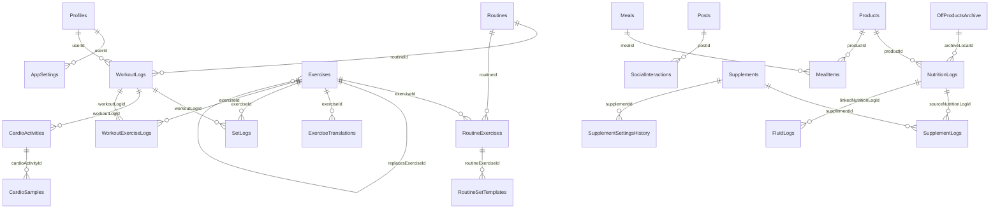

<!-- 
⚠️ AUTOMATED CONTEXT FILE - DO NOT EDIT MANUALLY. 
Generated by Antigravity Engine for optimal LLM context injection.
-->

# Train Libre: Comprehensive System Context File

> **Generation Prompt:**
> # Implementation Request: Generate Comprehensive Deep-Dive System Context File (`llm_context.md`)
> 
> We need to extract and consolidate the entire factual context of the 'Train Libre' application into a single, high-density, machine-readable Markdown file named `llm_context.md`. This file will serve as a permanent, high-fidelity context injection for Large Language Models (LLMs) to understand the codebase without parsing the entire repository on every prompt.
> 
> ### CRITICAL INSTRUCTION FOR THE AGENT
> You must explore the repository codebase deeply. Do not write high-level summaries. Dive straight into exact architectural patterns, state management mechanisms, local database tables, specific mathematical models (e.g., specific metabolic heuristics or submaximal strength equations), and exact multi-platform method channel bridges. 
> 
> ---
> 
> Technical Output Requirements
> 
> 1. **File Path:** Save this document directly into the root directory of the repository as `llm_context.md`.
> 2. **Header Declaration:** The absolute top of the file must feature a standard warning indicating it is AI-generated, immediately followed by the exact block quote containing the generation prompt used (the prompt provided below).
> 3. **Language:** The entire output must be compiled cleanly in English.
> 
> ---
> 
> Exact Content Specification Structure for `llm_context.md`
> 
> Please build out the file following this exact architecture:
> 
> ### [TOP BLOCK]
> ```markdown
> <!-- 
> ⚠️ AUTOMATED CONTEXT FILE - DO NOT EDIT MANUALLY. 
> Generated by Antigravity Engine for optimal LLM context injection.
> -->
> 
> # Train Libre: Comprehensive System Context File
> 
> > **Generation Prompt:**
> > [Insert the exact raw text of this entire implementation request here]
> 
> ```
> 
> ### 1. CORE ARCHITECTURAL PARADIGM
> 
> * **Framework & State Architecture:** Detail the exact multi-layered architecture used (e.g., Clean Architecture or feature-first folders), Riverpod/Provider state structures, and reactive flows.
> * **Local-First Infrastructure:** Detail how the Drift ORM integrates with SQLite on device. Explain migration strategies, transaction handling, and execution isolation (e.g., isolates or background channels).
> * **Zero-Cloud & Network Constraints:** Document all strictly constrained network boundaries (BYOK endpoint routing, public GitHub Pages catalog ingestion via GET requests, Open Food Facts synchronization layers) proving no user data leaves the device.
> 
> ### 2. DEEP-DIVE FEATURE ARCHITECTURAL SPECIFICATIONS
> 
> For each system module, provide exhaustive technical mechanics:
> 
> * **Adaptive Nutrition Engine:** Document the exact underlying mathematical equations used for tracking (Mifflin-St Jeor, Kevin Hall metabolic modeling equivalents, historical TDEE weight-loss trajectory tracking heuristics). Document database structures for food logging and product historization.
> * **Intelligent Workouts & Strength Diagnostics:** Explain how submaximal effort heuristics calculate predictive 1-Rep Max benchmarks (e.g., Epley equation integration). Map out the tables managing historical exercise volume tracking (`exercise_detail_screen`, `workout_summary_screen`).
> * **Sleep & Recovery Scoring:** Document the specific algorithmic heuristics running inside the Sleep Health Engine and muscle group systemic fatigue calculations (RIR tracking metrics, baseline recovery windows).
> * **AI Meal Capture & BYOK Architecture:** Detail the precise payload structures used to transmit local image bytes and raw text descriptions directly to generative endpoints. Document the secure extraction framework where API keys are encrypted inside the native secure enclave (`flutter_secure_storage`). Explain how the local matching pipeline relies on Jaro-Winkler string similarity matching against offline catalogs rather than sending calculations out to third parties.
> 
> ### 3. NATIVE PLATFORM BRIDGES
> 
> * Document the precise method channel layers bridging Flutter to iOS native ecosystems (e.g., `trainlibre.health/steps`, `trainlibre.health/sleep_healthkit` inside `AppDelegate.swift`). Explicitly trace out step segment, sleep interval, and heart rate sample extractions from `HKHealthStore`.
> 
> ### 4. DRIFT SQLITE DATABASE SCHEMA SCHEMATICS
> 
> * List all core database table definitions, cross-references, foreign key relationships, and data modeling abstractions critical for understanding state persistence.
> 
> ---
> 
> ## 🔍 Verification Protocol
> 
> 1. Compile the file completely into `llm_context.md`.
> 2. Review the file to ensure that no technical details or features are truncated or abstracted with generic placeholders (avoid "etc." or "TBD").

---

## 1. CORE ARCHITECTURAL PARADIGM

### Framework & State Architecture
Train Libre is built with Flutter and adopts a **feature-first, Clean Architecture-inspired layout**. Code is organized within the `lib/features/` folder by functional domain (e.g., `diary`, `workout`, `sleep`, `nutrition_recommendation`, `exercise_catalog`, `analytics`, `profile`, `steps`, `supplements`, `pulse`).

Each feature folder is typically divided into three layers:
1. **Domain**: Pure business logic, entity definitions, mathematical models, and service interfaces (e.g., Kalman filter math, sleep score engine).
2. **Data**: Data source implementations, schema bridges, repositories, and local persistence adapters (e.g., adapters querying SQLite to feed the domain model).
3. **Presentation**: User interface components, screens, and view models.

State management is powered by the **Provider + ChangeNotifier** pattern. 
- A central view model like `DiaryViewModel` coordinates multi-stream synchronization. It subscribes to **6 reactive streams** (Goals history, Food entries, Fluid entries, Supplements, Supplement logs, and Workouts logs).
- To prevent thread congestion from rapid, overlapping database updates, `DiaryViewModel` integrates a **16ms debounce timer** that coalesces stream updates before re-executing `CalculateDailyNutritionUseCase` calculations.

---

### Local-First Infrastructure
Local data persistence is built entirely on the **Drift ORM** interfacing with **SQLite** on the native device (`app_hybrid.sqlite`). 

Key architectural components include:
- **Connection Isolation**: Opened via a `LazyDatabase` pointing to a `NativeDatabase.createInBackground(file)`. This ensures database operations execute asynchronously on background threads rather than blocking the Flutter main isolate.
- **Foreign Key Constraints**: SQLite foreign keys are explicitly enforced via `PRAGMA foreign_keys = ON` executed inside connection initialization.
- **Migration Strategy**: Migrations are managed inside `drift_database.dart` using standard schema versioning. The schema is currently at **Version 24**, featuring incremental upgrades that handle column additions defensively (e.g., `addTableColumn` and `createTable` operations wrapped in checks for existing schemas to prevent duplicate column exceptions in field upgrades).
- **Transaction Isolation**: Broad operations like `clearAllUserData` are executed inside a Drift transaction block where foreign keys are temporarily disabled, tables cleared in strict dependency order, and foreign keys re-enabled.

---

### Zero-Cloud & Network Constraints
Train Libre is an **offline-first application** requiring no remote registration or cloud sync. All personal, fitness, and health data remain strictly localized to the device database.

Strict network boundaries are documented as follows:
1. **BYOK (Bring-Your-Own-Key) Endpoint Routing**: AI features (AI Meal Capture) connect directly to user-configured APIs (OpenAI, Gemini, Anthropic, Mistral, xAI, or local Ollama instances) using the keys stored securely on the device. No intermediate proxy servers are used.
2. **Public Release Catalog Ingestion**: Updating base catalogs (foods and exercises) relies solely on **GET requests** fetching static, precompiled SQLite files and JSON manifests hosted on public GitHub Releases (e.g., `https://github.com/rfivesix/train-libre/releases/`). No device telemetry or user data is ever sent during these fetches.
3. **Open Food Facts (OFF) Databases**: The application downloads complete pre-built country-specific OFF database slices (.db files) directly to local storage. Searching, matching, and barcode looking up happen entirely **on-device** using SQLite queries against these offline tables rather than executing remote queries per scan.

---

## 2. DEEP-DIVE FEATURE ARCHITECTURAL SPECIFICATIONS

### Adaptive Nutrition Engine
The Adaptive Nutrition Engine calculates individualized calorie and macronutrient targets dynamically using recursive filters that process historical weight and consumption logs.

#### 1. Basal Metabolic Rate (BMR/RMR) Calculations
Calculated inside `recommendation_input_adapter.dart` using two main pathways:
* **Lean-Mass Path (Katch-McArdle)**: Preferred when a body fat percentage \(BF\%\) between \(3\%\) and \(70\%\) is recorded.
  $$\text{Lean Mass (kg)} = \text{Weight (kg)} \times \left(1 - \frac{BF\%}{100}\right)$$
  $$\text{RMR (kcal/day)} = 370 + 21.6 \times \text{Lean Mass (kg)}$$
* **Standard Path (Mifflin-St Jeor)**: Fallback path when body fat is unavailable.
  $$\text{Base Mifflin} = 10 \times \text{Weight (kg)} + 6.25 \times \text{Height (cm)} - 5 \times \text{Age (years)}$$
  $$\text{RMR (kcal/day)} = \begin{cases} 
  \text{Base Mifflin} + 5 & \text{if male} \\
  \text{Base Mifflin} - 161 & \text{if female} \\
  \text{Base Mifflin} - 78 & \text{if diverse/other} 
  \end{cases}$$

#### 2. TDEE & Activity Multipliers
Total Daily Energy Expenditure (TDEE) adjusts the base RMR by applying an activity multiplier modified by user habits:
$$\text{TDEE} = \text{RMR} \times \text{Activity Factor}$$
$$\text{Activity Factor} = \text{clamp}(\text{Base Activity} + \text{Workout Adj} + \text{Steps Adj} + \text{Cardio Adj}, 1.20, 1.95)$$

* **Base Activity Level Multipliers**:
  - Low: `1.35`
  - Moderate: `1.50`
  - High: `1.65`
  - Very High: `1.75`
* **Workout Frequency Adjustment**:
  - \(\ge 5\) workouts/week: `+0.06`
  - \(\ge 3\) workouts/week: `+0.04`
  - \(\ge 1\) workouts/week: `+0.02`
* **Step Count Adjustment** (using rolling 21-day steps average):
  - \(\ge 13,000\) steps/day: `+0.05`
  - \(\ge 10,000\) steps/day: `+0.03`
  - \(< 7,000\) steps/day: `-0.03`
* **Cardio Duration Adjustment** (extra outside-app endurance hours/week):
  - 1 hour: `+0.01` | 2 hours: `+0.02` | 3 hours: `+0.03` | 5 hours: `+0.05` | \(\ge 7\) hours: `+0.07`

#### 3. Target Rates & Caloric Deficits/Surpluses
Calorie adjustments are computed using the physical energy density equivalent of weight tissue:
* **Caloric Factor**: \(7700\text{ kcal}\) per \(\text{kg}\) of body tissue (equivalent to \(1100\text{ kcal/day}\) per \(\text{kg/week}\) of gain/loss rate).
$$\text{Adjustment (kcal/day)} = \text{round}(\text{Target Rate (kg/week)} \times 1100)$$
$$\text{Recommended Calories} = \text{TDEE} + \text{Adjustment}$$

* **Safety Floor**: Recommended Calories are clamped to a hard minimum of **\(1200\text{ kcal/day}\)**. If the floor is hit, target macro distributions are adjusted, and recommendation confidence is marked low.
* **Supported Weekly Rates**:
  - Weight Loss: \(-0.25\text{ kg/week}\), \(-0.50\text{ kg/week}\) (default), \(-0.75\text{ kg/week}\), \(-1.00\text{ kg/week}\).
  - Maintenance: \(0\text{ kg/week}\).
  - Weight Gain: \(+0.10\text{ kg/week}\), \(+0.25\text{ kg/week}\) (default), \(+0.50\text{ kg/week}\).

#### 4. Macro Nutrient Allocation Heuristic
Allocated in order of structural priority:
1. **Protein**: Determined by goal and body weight.
   - Loss Phase: \(2.0\text{ g/kg}\) body weight.
   - Maintenance/Gain Phase: \(1.8\text{ g/kg}\) body weight.
   $$\text{Protein Target (g)} = \text{round}(\text{Weight (kg)} \times \text{Protein Factor})$$
2. **Fat**: Computed using a bodyweight multiplier bounded by safe extremes.
   $$\text{Fat Target (g)} = \text{clamp}(\text{round}(\text{Weight (kg)} \times 0.60), 35\text{ g}, 130\text{ g})$$
3. **Carbohydrates**: Allocated the remaining calorie budget.
   $$\text{Carb Target (g)} = \text{round}\left(\frac{\text{Recommended Calories} - (\text{Protein Target} \times 4) - (\text{Fat Target} \times 9)}{4}\right)$$
   - *Residual Constraint*: If the Carb Target calculates to \(< 0\text{ g}\), carbs are set to \(0\text{ g}\), fats are lowered to a minimum of \(25\text{ g}\), and protein is reduced if necessary to satisfy the daily caloric budget constraint.

#### 5. Bayesian TDEE Estimator (Recursive Kalman Filter)
The core adaptive algorithm implements a one-dimensional Kalman filter that estimates the user's actual metabolic maintenance level from their weight trajectories and logged intakes.

* **Parameters**:
  - Process Noise (TDEE drift variance \(Q\)): \(40\text{ kcal/day}^2\) weekly.
  - Base Observation Noise (\(R_{\text{base}}\)): \(120\text{ kcal/day}\) standard deviation.
  - Daily Intake Logging Noise (\(\sigma_{\text{intake}}\)): \(320\text{ kcal/day}\) standard deviation.
  - Weight Slope Estimation Noise (\(\sigma_{\text{slope}}\)): \(0.55\text{ kg/week}\) standard deviation.
  - Lower/Upper Maintenance Limits: \(1200\) to \(5000\text{ kcal/day}\).
* **Observation Model**:
  $$\text{Observed Maintenance} = \text{Average Logged Calories} - \left(\text{Weight Slope (kg/week)} \times \frac{\text{Phase Energy Density}}{7}\right)$$
  - *Phase Energy Density*: Ramps linearly from \(3000\text{ kcal/kg}\) at the start of a diet phase up to the mature tissue value of \(7700\text{ kcal/kg}\) at Week 9 to account for initial glycogen/water drops.
* **Observation Variance (\(R\))**:
  $$R_{\text{ref}} = \max(R_{\text{base}}^2 + \text{Intake Variance} + \text{Slope Variance}, 1.0)$$
  $$\text{Intake Variance} = \frac{\sigma_{\text{intake}}^2}{\max(\text{Intake Logged Days}, 1)}$$
  $$\text{Slope Variance} = \frac{(\sigma_{\text{slope}} \times \text{Phase Energy Density} / 7)^2}{\max(\text{Weight Logs Count} - 1, 1)}$$
  $$R = R_{\text{ref}} \times \text{Completeness Multiplier}^2 \times \text{Quality Penalty}^2$$
  - *Completeness Multiplier*: Evaluates logging frequency relative to the evaluation window. Penalizes sparse logging (e.g., \(< 5\) days).
  - *Quality Penalty*: Multipliers applied for unresolved food items (\(1.30\)), sparse weight logs (\(1.10\)), or sparse food logs (\(1.12\)).
* **Filter Updates**:
  $$\text{Predicted Mean } \hat{x}_{k|k-1} = x_{k-1|k-1}$$
  $$\text{Predicted Variance } P_{k|k-1} = \min(P_{k-1|k-1} + Q \times \Delta t, \text{Variance Cap})$$
  $$\text{Kalman Gain } K_k = \frac{P_{k|k-1}}{P_{k|k-1} + R_k}$$
  $$\text{Updated Mean } x_{k|k} = \hat{x}_{k|k-1} + K_k \times (\text{Observed Maintenance}_k - \hat{x}_{k|k-1})$$
  $$\text{Updated Variance } P_{k|k} = (1 - K_k) \times P_{k|k-1}$$
* **History-Based Adaptive Noise Calibration**:
  If \ge 4 historical data points are registered:
  - Observation noise \(R\) is scaled by the variance of the residuals of recent observations.
  - Process noise \(Q\) is scaled by the root-mean-square weekly delta of the posterior mean.
* **Weight Smoothing & Trend Slope**:
  - Weight values are smoothed using an Exponentially Weighted Moving Average (EWMA) with smoothing factor \(\alpha = 0.35\).
  - Weight trend slope is calculated using Ordinary Least Squares (OLS) linear regression over a rolling 21-day window.

---

### Intelligent Workouts & Strength Diagnostics

#### 1. Submaximal e1RM (Estimated 1-Rep Max) Heuristics
Predictive strength diagnostic metrics utilize two distinct equations to estimate 1-Rep Max:
* **Brzycki Equation** (Default for database metrics, live logging rows, and personal records):
  $$\text{e1RM} = \text{Weight} \times \left(\frac{36}{37 - \text{Reps}}\right)$$
* **Epley Equation** (Used in detail screens and summaries for comparative heuristics):
  $$\text{e1RM} = \text{Weight} \times \left(1 + \frac{\text{Reps}}{30}\right)$$
* **Eligibility Rules**: To ensure reliability, e1RM is calculated *only* if the set satisfies the following criteria:
  - Reps are between \(1\) and \(10\) inclusive (\(\text{Reps} \le 10\)). High-rep sets are excluded.
  - Set type is completed (`isCompleted == true`) and is *not* marked as a warmup (`setType != 'warmup'`).
  - Recorded weight is greater than \(0\).

#### 2. Volume and Intensity Metrics
* **Total Volume**: Sum of \(\text{Weight} \times \text{Reps}\) across all completed working sets.
* **RIR (Reps In Reserve)**: Logged directly by the user per set to track proximity to failure.
* **Equivalent Working Sets**: Working volume is adjusted based on set proximity to failure (RIR/RPE). Warmups count as \(0\) equivalent sets. Set intensity modifiers scale sets according to training stress.

#### 3. Exercise Catalog Synchronization
Exercises are structured under `Exercises` (storing category name, muscle group JSON arrays, custom flag, and source) and localized via `ExerciseTranslations` (languageCode, name, and description).
- Updates are pulled as SQLite files from GitHub Releases.
- During updates, historical exercises referenced in user workout logs are retained via `replacesExerciseId` self-references, preserving historical volume records even if a base exercise is renamed or updated in the catalog.

---

### Sleep & Recovery Scoring

#### 1. Sleep Health Score (SHS v3)
Calculates a multi-domain Sleep Health Score between \(0\) and \(100\). The overall score is a weighted combination of five sub-scores:
$$\text{Base Score} = \frac{\sum (W_i \times S_i)}{\sum W_i}$$

| Domain | Key Code | Weight (\(W_i\)) | Target / Formula |
|---|---|---|---|
| **Duration** | D | `0.30` | Gaussian curve centered on \(7.5\text{h}\) (plateaus between \(7.0\text{h}\) and \(9.0\text{h}\), drops to \(0\) at \(<5.0\text{h}\) or \(>10.5\text{h}\)). |
| **Continuity** | C | `0.20` | Combined average of Sleep Efficiency (logistic curve: \(1 / (1 + e^{-50(\text{SE\%}/100 - 0.90)})\)) and WASO (quadratic decay: \(1 / (1 + (\max(\text{WASO} - 20, 0) / 30)^2)\)). |
| **Architecture** | A | `0.25` | Minutes-based evaluation: Deep Sleep (N3) target is \(90\text{ min}\); REM target is \(100\text{ min}\). Scaled downward if light sleep exceeds \(65\%\). |
| **Timing** | T | `0.15` | Mid-sleep hour Gaussian curve centered at 03:30 (\(3.5\)), with an exponential late-phase penalty drop for mid-sleep times \(> 5.5\). |
| **Regularity** | R | `0.10` | Inverse-quadratic decay based on standard deviation of mid-sleep time: \(1 / (1 + \text{SD}^2)\). Needs \ge 5 days of data. |

* **Dynamic Multiplier Penalties**: The base score is degraded by multiplying it by the lowest of these activation factors:
  - *Short Sleep Penalty*: If sleep duration \(< 6.5\text{ hours}\), drops linearly to a minimum multiplier of `0.50` at \(5.0\text{ hours}\).
  - *Deep Sleep Deficit*: If N3 duration \(< 70\text{ minutes}\), drops linearly to a minimum multiplier of `0.60` at \(40\text{ minutes}\).
  - *REM Deficit*: If REM duration \(< 60\text{ minutes}\), drops linearly to a minimum multiplier of `0.65` at \(40\text{ minutes}\).
  - *Circadian Shift*: If mid-sleep time \(> 5.5\), drops linearly to a minimum multiplier of `0.55` at \(7.5\).

#### 2. Muscle Readiness & Recovery Scoring
Monitors local muscular fatigue across 10 canonical major muscle groups (`chest`, `back`, `shoulders`, `biceps`, `triceps`, `quads`, `hamstrings`, `glutes`, `adductors`, `calves`).

* **Fatigue Extension Hours**: Baselines are established per muscle profile. Working sets alter recovery windows based on training stress:
  $$\text{Recovery Window} = \text{Profile Hours} + \text{Load-Based Hours} + \text{Fatigue Extension Hours}$$
  - *Profile Hours (Recovering / Ready)*: Lower Back (\(72\text{h} / 120\text{h}\)), Quads/Hams/Glutes (\(60\text{h} / 96\text{h}\)), Shoulders/Arms/Calves (\(36\text{h} / 60\text{h}\)), Chest/Back/Core (\(48\text{h} / 72\text{h}\)).
  - *Load-Based Hours*: Based on the sets completed for that muscle during the workout. Adds \(0\text{h}\) (sets \(< 3.0\)), \(6\text{h}\) (sets \(3.0\) to \(4.9\")), \(12\text{h}\) (sets \(5.0\) to \(7.9\")), \(24\text{h}\) (sets \(8.0\) to \(10.9\")), or \(36\text{h}\) (sets \(\ge 11.0\)).
  - *Fatigue Extension Hours*: Adds **\(24\text{ hours}\)** if the workout is flagged for high session fatigue.
* **High Session Fatigue**: Triggered if the average RIR across all sets in a workout is \(\le 0.5\) or average RPE is \(\ge 8.5\).
* **Readiness Score (0 to 100)**:
  - If hours since last load \(H \le \text{recoveringUpperHours}\): Lerps from \(10.0\) to \(60.0\) based on progress.
  - If \(\text{recoveringUpperHours} < H \le \text{readyUpperHours}\): Lerps from \(60.0\) to \(85.0\).
  - If \(H > \text{readyUpperHours}\): Lerps from \(85.0\) to \(100.0\) over a \(48\text{-hour}\) window.
* **Recovery Pressure Score (0 to 100)**:
  $$\text{Pressure} = \text{Load Component} + \text{Recency Component} + \text{Fatigue Penalty}$$
  - *Load Component*: Non-linear lookup table interpolating sets (from \(0\) at \(0\text{ sets}\), \(34\) at \(4\text{ sets}\), up to \(65\) at \(12\text{ sets}\)).
  - *Recency Component*: \((96.0 - \text{Hours Since Last Load}).\text{clamp}(0, 96) / 96.0 \times 25\).
  - *Fatigue Penalty*: Adds \(10.0\) if session fatigue was high.

---

### AI Meal Capture & BYOK Architecture
Allows users to snap photos or write descriptions of meals to calculate local product database logging matches, without sending personal records to a cloud service.

#### 1. Secured Cryptographic Key Storage
API keys, custom endpoints, and target models are encrypted inside the iOS Keychain or Android Keystore via the `FlutterSecureStorage` library using these identifiers:
- `ai_api_key_{providerName}` (Keys per provider: `openai`, `gemini`, `anthropic`, `mistral`, `xai`, `ollama`, `custom`).
- `ai_selected_provider` (Current provider).
- `ai_selected_model_{providerName}` (Selected model).
- `ai_custom_base_url` (Custom base URL override for local Ollama/OpenAI-compatible endpoints).

#### 2. Payload Schemas & Provider Routing
The system formats payloads based on the active provider. Images are read as local bytes and base64 encoded.
* **OpenAI / Ollama / Custom compatible JSON**:
  ```json
  {
    "model": "<model>",
    "messages": [
      {"role": "system", "content": "<systemPrompt>"},
      {"role": "user", "content": [
        {"type": "image_url", "image_url": {"url": "data:image/jpeg;base64,<base64>", "detail": "low"}},
        {"type": "text", "text": "<userInput>"}
      ]}
    ],
    "temperature": 0.3
  }
  ```
* **Gemini (v1beta / v1)**:
  System prompt is prepended directly to the user input inside the parts array:
  ```json
  {
    "contents": [{
      "parts": [
        {"inlineData": {"mimeType": "image/jpeg", "data": "<base64>"}},
        {"text": "<systemPrompt>\n\n<userInput>"}
      ]
    }],
    "generationConfig": {"temperature": 0.3, "maxOutputTokens": 8192}
  }
  ```
* **Anthropic**:
  Uses a dedicated `system` parameter in the root, and structured `image` and `text` parts in `messages`:
  ```json
  {
    "model": "<model>",
    "system": "<systemPrompt>",
    "max_tokens": 2000,
    "temperature": 0.3,
    "messages": [{
      "role": "user",
      "content": [
        {"type": "image", "source": {"type": "base64", "media_type": "image/jpeg", "data": "<base64>"}},
        {"type": "text", "text": "<userInput>"}
      ]
    }]
  }
  ```

#### 3. AI Prompts
- **System Prompt**: Instructs the model to establish a holistic meal context anchor (dish type, estimated calories, macro target ranges) and decompose the meal into its atomic ingredients (e.g. "Cheeseburger and Fries" is returned as: burger bun, beef patty, cheese slice, tomato, ketchup, fries) with estimated weights in grams. The output is constrained to return *only* a valid JSON object matching the `mealContext` and `items` schema. No nutrition data is requested in the items array to prevent model hallucination of calories.
- **Repair Prompt**: Triggered when local validation fails. Provides a feedback string outlining issues (e.g. "Item X has no database match", or "Total calories deviate too far from the context") along with a list of matching database candidates. Instructs the model to select an exact name from the candidate list and adjust weights to align the meal's total calories with the target profile.

#### 4. Local Database Matching Pipeline
Once the JSON response is parsed into `AiMealCandidateItem` components, they are matched against the local database:
1. **Fuzzy Search Query**: Splits the item name into alphanumeric tokens. German plural rules are handled (e.g. replacing "eier" with "ei" or trimming "er" endings).
2. **Database Candidates**: Fetches matching database candidates, sorted by: exact matches first, followed by products used in the last 30 days, prefix matches, source order (base catalog > user custom catalog > OFF local database), and finally name length.
3. **Similarity Score Calculation**:
   - Exact string match: `1.0`
   - DB name starts with query: `0.86`
   - Query starts with DB name: `0.78`
   - DB name contains query: `0.70`
   - Token overlap: `(matching tokens / query tokens) * 0.65`
4. **State Verification**: Compares the query state (e.g., "cooked" vs "raw") with database names. If a state mismatch is found (e.g. raw chicken matched to cooked chicken), a warning or error is logged based on the calorie difference.

#### 5. Validation Engine Rules & Repair Loop
Matches are analyzed by the `AiMealValidationEngine`:
* **Item-Level Checks**: Triggers errors for non-positive quantities, extreme weights (\(> 3.0\text{ kg}\)), unmatched items, or major raw-vs-cooked state mismatches.
* **Meal-Level Checks**: Validates total calories and macronutrient deviations against the context range.
* **Validation Score**: Starts at `100` and decrements: `-2` for info, `-8` for warnings, `-24` for errors, and `-12` for macro fit mismatches.
* **Repair Loop**: If a validation check fails, the validation results and database candidates are formatted into a repair prompt. The model is queried again at temperature `0.1` to adjust the meal plan. The process repeats for a maximum of 3 passes.

---

## 3. NATIVE PLATFORM BRIDGES

Communication between Flutter and the host operating systems is managed via Flutter **Method Channels**.

### iOS Integration (`AppDelegate.swift`)

#### 1. Method Channel Names
* `trainlibre.health/steps`
* `trainlibre.health/sleep_healthkit`
* `trainlibre.health/export_apple_health`

#### 2. Native HealthKit Fetch Mechanics
* **Steps Retrieval (`readStepSegments`)**:
  Queries the `HKHealthStore` for samples of quantity type `.stepCount` using an `HKSampleQuery` bounded by start and end dates. Mapped results are returned as a dictionary containing:
  - `startAtUtcIso` / `endAtUtcIso`: Sample timestamps formatted in ISO 8601 UTC.
  - `stepCount`: Steps calculated as `Int(sample.quantity.doubleValue(for: HKUnit.count()))`.
  - `sourceId`: Bundle identifier of the source app.
  - `nativeId`: CoreData UUID string.
* **Sleep and Heart Rate Query (`readSleepAndHeartRate`)**:
  Executes two queries in parallel using a `DispatchGroup`:
  - Sleep samples are fetched using category type `.sleepAnalysis`.
  - Heart rate samples are fetched using quantity type `.heartRate`.
  - Mapped segments: Mapped to database keys: `inBed.rawValue` -> `"in_bed"`, `awake.rawValue` -> `"awake"`, other -> `"asleep"`.
  - Mapped Heart Rate: Heart rate samples are filtered to only return values that overlap with a sleep segment's start and end times.
* **Writing Data to HealthKit**:
  - `writeMeasurement`: Saves `.bodyMass`, `.bodyFatPercentage` (value divided by 100), or `.bodyMassIndex` samples.
  - `writeNutrition`: Saves dietary quantity samples (.dietaryEnergyConsumed, .dietaryProtein, .dietaryCarbohydrates, .dietaryFatTotal, .dietaryFiber, .dietarySugar, .dietarySodium).
  - `writeHydration`: Saves dietary water consumption in liters (.dietaryWater).
  - `writeWorkout`: Saves workouts (.traditionalStrengthTraining, .running, .walking, .cycling, or .yoga) with calories burned and custom summaries saved to metadata under the `"trainlibre_workout_summary"` key.

---

### Android Integration (`MainActivity.kt`)

#### 1. Health Connect API
Android implements identical channel names (`trainlibre.health/steps`, `trainlibre.health/sleep_healthkit`, `trainlibre.health/export_apple_health`) but routes queries through **Android Health Connect**:
- Checks API availability status using `HealthConnectClient.getSdkStatus(context)`.
- Requests permissions dynamically for step records, sleep session records, heart rate records, weight records, total calories burned, and dietary consumption metrics.
- Queries `StepsRecord`, `SleepSessionRecord`, and `HeartRateRecord` databases using time range filters.
- Maps records into identical payload JSON dictionaries to match iOS structures.

#### 2. Android Storage Access Framework (SAF)
* **Channel Name**: `trainlibre.storage/saf`
* **Purpose**: Manages file system operations under SAF:
  - Requests directory permissions via SAF intents.
  - Writes database backup files to the selected directory tree.
  - Automatically prunes old backups to prevent excessive storage use.

---

## 4. DRIFT SQLITE DATABASE SCHEMA SCHEMATICS

Below is the complete database structure of the 30 tables managed by the Drift ORM, followed by raw SQL tables and indexes.

### Core Database Tables



#### 1. `Profiles`
Stores user profile information.
* `localId` (Int, Auto-Increment, Primary Key)
* `id` (Text, Unique, default: UUID)
* `createdAt` (DateTime, default: current time)
* `updatedAt` (DateTime, default: current time)
* `deletedAt` (DateTime, Nullable)
* `username` (Text, Nullable)
* `isCoach` (Bool, default: false)
* `visibility` (Text, default: 'private' - 'public', 'private', or 'friends')
* `birthday` (DateTime, Nullable)
* `height` (Int, Nullable, in cm)
* `gender` (Text, Nullable - 'male', 'female', or 'diverse')
* `profileImagePath` (Text, Nullable)

#### 2. `AppSettings`
Manages application configuration and target goals.
* `localId` (Int, Auto-Increment, Primary Key)
* `id` (Text, Unique, default: UUID)
* `createdAt` / `updatedAt` / `deletedAt` (MetaColumns)
* `userId` (Text, Foreign Key -> `Profiles.id`)
* `themeMode` (Text, default: 'system')
* `unitSystem` (Text, default: 'metric')
* `targetCalories` (Int, default: 2500)
* `targetProtein` (Int, default: 180)
* `targetCarbs` (Int, default: 250)
* `targetFat` (Int, default: 80)
* `targetWater` (Int, default: 3000)
* `targetSteps` (Int, default: 8000)

#### 3. `Exercises`
Defines workout exercises.
* `localId` / `id` (HybridId)
* `createdAt` / `updatedAt` / `deletedAt` (MetaColumns)
* `createdBy` (Text, Nullable, null for system exercises)
* `categoryName` (Text, Nullable)
* `imagePath` (Text, Nullable)
* `musclesPrimary` (Text, Nullable, JSON string array)
* `musclesSecondary` (Text, Nullable, JSON string array)
* `isCustom` (Bool, default: false)
* `source` (Text, default: 'user')
* `usageCount` (Int, default: 0)
* `replacesExerciseId` (Text, Nullable, Foreign Key -> `Exercises.id` self-reference)

#### 4. `ExerciseTranslations`
Localized exercise descriptions.
* `localId` / `id` (HybridId)
* `createdAt` / `updatedAt` / `deletedAt` (MetaColumns)
* `exerciseId` (Text, Foreign Key -> `Exercises.id` ON DELETE CASCADE)
* `languageCode` (Text, English/German/French/Italian/Japanese)
* `name` (Text, Not Null)
* `description` (Text, Nullable)
* *Composite Unique Key*: `{exerciseId, languageCode}`

#### 5. `Routines`
Preplanned workout routines.
* `localId` / `id` / `MetaColumns`
* `userId` (Text, Nullable)
* `name` (Text, Not Null)
* `isPublic` (Bool, default: false)

#### 6. `RoutineExercises`
Exercises associated with a routine.
* `localId` / `id` / `MetaColumns`
* `routineId` (Text, Foreign Key -> `Routines.id` ON DELETE CASCADE)
* `exerciseId` (Text, Foreign Key -> `Exercises.id`)
* `orderIndex` (Int, Not Null)
* `pauseSeconds` (Int, Nullable)
* `notes` (Text, Nullable)

#### 7. `RoutineSetTemplates`
Target parameters configured for sets within a routine.
* `localId` / `id` / `MetaColumns`
* `routineExerciseId` (Text, Foreign Key -> `RoutineExercises.id` ON DELETE CASCADE)
* `setType` (Text, default: 'normal' - 'warmup', 'dropset', 'failure', or 'normal')
* `targetReps` (Text, Nullable, allows strings like "8-12")
* `targetWeight` (Real, Nullable)
* `targetRir` (Int, Nullable)

#### 8. `WorkoutLogs`
Completed workouts.
* `localId` / `id` / `MetaColumns`
* `userId` (Text, Nullable)
* `routineId` (Text, Nullable, Foreign Key -> `Routines.id`)
* `routineNameSnapshot` (Text, Nullable)
* `startTime` (DateTime, Not Null)
* `endTime` (DateTime, Nullable)
* `status` (Text, default: 'ongoing' - 'ongoing' or 'completed')
* `visibility` (Text, default: 'private')
* `notes` (Text, Nullable)

#### 9. `SetLogs`
Logged sets for a workout.
* `localId` / `id` / `MetaColumns`
* `workoutLogId` (Text, Foreign Key -> `WorkoutLogs.id` ON DELETE CASCADE)
* `exerciseId` (Text, Nullable, Foreign Key -> `Exercises.id`)
* `exerciseNameSnapshot` (Text, Nullable)
* `weight` (Real, Nullable)
* `reps` (Int, Nullable)
* `rpe` (Int, Nullable)
* `rir` (Int, Nullable)
* `setType` (Text, default: 'normal')
* `restTimeSeconds` (Int, Nullable)
* `isCompleted` (Bool, default: false)
* `logOrder` (Int, default: 0)
* `distance` (Real, Nullable, for cardio)
* `durationSeconds` (Int, Nullable, for cardio)
* `notes` (Text, Nullable)

#### 10. `CardioActivities`
* `localId` / `id` / `MetaColumns`
* `workoutLogId` (Text, Foreign Key -> `WorkoutLogs.id` ON DELETE CASCADE)
* `type` (Text, Not Null)
* `distance` (Real, Nullable)
* `durationSeconds` (Int, Nullable)
* `kcal` (Int, Nullable)
* `source` (Text, Nullable)

#### 11. `CardioSamples`
Detailed sample data for cardio activities (e.g. speeds or heart rates).
* `localId` / `id` / `MetaColumns`
* `cardioActivityId` (Text, Foreign Key -> `CardioActivities.id` ON DELETE CASCADE)
* `dataType` (Text, Not Null)
* `dataJson` (Text, Not Null)

#### 12. `Products`
Stores food nutrition details.
* `localId` / `id` / `MetaColumns`
* `barcode` (Text, Unique)
* `name` (Text, Not Null)
* `nameDe` / `nameEn` / `nameFr` / `nameIt` / `nameJa` (Text, Nullable)
* `brand` (Text, Nullable)
* `calories` (Int, Not Null)
* `protein` / `carbs` / `fat` (Real, Not Null)
* `sugar` / `fiber` / `salt` / `caffeine` (Real, Nullable)
* `caffeineMgPer100g` (Real, Nullable)
* `ingredientsText` (Text, Nullable)
* `ingredientsAnalysisTags` / `additivesTags` (Text, Nullable)
* `productQuantity` (Real, Nullable)
* `productQuantityUnit` (Text, Nullable)
* `isFluid` / `isLiquid` (Bool, default: false)
* `source` (Text, default: 'user' - 'user', 'base', or 'off')
* `category` (Text, Nullable)
* `categoryFr` / `categoryIt` / `categoryJa` (Text, Nullable)
* `usageCount` (Int, default: 0)

#### 13. `OffProductsArchive`
Caches product details from deleted Open Food Facts catalog items.
* `localId` / `id` / `MetaColumns`
* `barcode` (Text, Not Null)
* `productName` (Text, Not Null)
* `brand` (Text, Nullable)
* `calories` (Int, Not Null)
* `protein` / `carbs` / `fat` / `sugar` / `fiber` / `salt` / `caffeine` / `caffeineMgPer100g` (Real/Int)
* `productQuantity` / `productQuantityUnit` (Real/Text)
* `isFluid` / `isLiquid` (Bool)
* `category` (Text, Nullable)
* `contentHash` (Text, Not Null)
* `source` (Text, Not Null)
* `hadUserOverride` (Bool, default: false)

#### 14. `NutritionLogs`
Logged food entries.
* `localId` / `id` / `MetaColumns`
* `userId` (Text, Nullable)
* `productId` (Text, Nullable, Foreign Key -> `Products.id`)
* `legacyBarcode` (Text, Nullable)
* `consumedAt` (DateTime, Not Null)
* `amount` (Real, Not Null, in grams or ml)
* `mealType` (Text, default: 'Snack')
* `archiveLocalId` (Int, Nullable, Foreign Key -> `OffProductsArchive.localId`)

#### 15. `Supplements`
* `localId` / `id` / `MetaColumns`
* `code` (Text, Nullable, Unique)
* `name` (Text, Not Null)
* `dose` (Real, Not Null)
* `unit` (Text, Not Null)
* `dailyGoal` / `dailyLimit` (Real, Nullable)
* `notes` (Text, Nullable)
* `isBuiltin` (Bool, default: false)
* `isTracked` (Bool, default: true)

#### 16. `SupplementLogs`
* `localId` / `id` / `MetaColumns`
* `supplementId` (Text, Foreign Key -> `Supplements.id` ON DELETE CASCADE)
* `takenAt` (DateTime, Not Null)
* `amount` (Real, Not Null)
* `sourceNutritionLogId` (Text, Nullable, Foreign Key -> `NutritionLogs.id` ON DELETE SET NULL)

#### 17. `FluidLogs`
* `localId` / `id` / `MetaColumns`
* `consumedAt` (DateTime, Not Null)
* `amountMl` (Int, Not Null)
* `name` (Text, Not Null)
* `kcal` (Int, Nullable)
* `sugarPer100ml` / `carbsPer100ml` / `caffeinePer100ml` (Real, Nullable)
* `linkedNutritionLogId` (Text, Nullable, Foreign Key -> `NutritionLogs.id` ON DELETE CASCADE)

#### 18. `Measurements`
* `localId` / `id` / `MetaColumns`
* `userId` (Text, Nullable)
* `type` (Text, Not Null, e.g. 'weight', 'chest', or 'bodyFatPercentage')
* `value` (Real, Not Null)
* `unit` (Text, Not Null)
* `date` (DateTime, Not Null)
* `legacySessionId` (Int, Nullable)

#### 19. `Posts`
* `localId` / `id` / `MetaColumns`
* `userId` (Text, Not Null)
* `type` (Text, Not Null)
* `referenceId` (Text, Nullable)
* `metadata` (Text, Nullable, JSON)
* `content` (Text, Nullable)

#### 20. `SocialInteractions`
* `localId` / `id` / `MetaColumns`
* `postId` (Text, Foreign Key -> `Posts.id` ON DELETE CASCADE)
* `userId` (Text, Not Null)
* `type` (Text, Not Null)
* `content` (Text, Nullable)

#### 21. `Meals`
Custom meal templates.
* `localId` / `id` / `MetaColumns`
* `userId` (Text, Nullable)
* `name` (Text, Not Null)
* `notes` (Text, Nullable)

#### 22. `MealItems`
Items inside custom meals.
* `localId` / `id` / `MetaColumns`
* `mealId` (Text, Foreign Key -> `Meals.id` ON DELETE CASCADE)
* `productBarcode` (Text, Nullable)
* `productId` (Text, Nullable, Foreign Key -> `Products.id`)
* `quantityInGrams` (Int, Not Null)

#### 23. `FoodCategories`
* `key` (Text, Primary Key)
* `nameDe` / `nameEn` / `nameFr` / `nameIt` / `nameJa` (Text, Nullable)
* `emoji` (Text, Nullable)

#### 24. `Favorites`
* `barcode` (Text, Primary Key)
* `createdAt` / `updatedAt` / `deletedAt` (MetaColumns)

#### 25. `DailyGoalsHistory`
Auditable logs of daily calorie and macro goals.
* `localId` / `id` / `MetaColumns`
* `targetCalories` / `targetProtein` / `targetCarbs` / `targetFat` / `targetWater` / `targetSteps` (Int, Not Null)

#### 26. `SupplementSettingsHistory`
* `localId` / `id` / `MetaColumns`
* `supplementId` (Text, Foreign Key -> `Supplements.id` ON DELETE CASCADE)
* `isTracked` (Bool, default: true)
* `dose` (Real, Not Null)
* `dailyGoal` / `dailyLimit` (Real, Nullable)

#### 27. `HealthStepSegments`
Cached step details imported from HealthKit or Health Connect.
* `localId` / `id` / `MetaColumns`
* `provider` (Text, Not Null)
* `sourceId` (Text, Nullable)
* `startAt` / `endAt` (DateTime, Not Null)
* `stepCount` (Int, Not Null)
* `externalKey` (Text, Unique)

#### 28. `WorkoutExerciseLogs`
Exercises recorded in a workout session.
* `localId` / `id` / `MetaColumns`
* `workoutLogId` (Text, Foreign Key -> `WorkoutLogs.id` ON DELETE CASCADE)
* `exerciseId` (Text, Nullable, Foreign Key -> `Exercises.id`)
* `exerciseNameSnapshot` (Text, Nullable)
* `notes` (Text, Nullable)

#### 29. `UserFoodOverrides`
* `localId` / `id` / `MetaColumns`
* `barcode` (Text, Unique)
* `name` / `brand` / `calories` / `protein` / `carbs` / `fat` / `sugar` / `fiber` / `salt` / `caffeine` / `caffeineMgPer100g` / `ingredientsText` / `ingredientsAnalysisTags` / `additivesTags` / `productQuantity` / `productQuantityUnit` / `isFluid` / `isLiquid` / `category` (Schema fields identical to `Products`)

#### 30. `UserFoodOverrideTranslations`
* `localId` / `id` / `MetaColumns`
* `userFoodOverrideId` (Text, Foreign Key -> `UserFoodOverrides.id` ON DELETE CASCADE)
* `languageCode` (Text, Not Null)
* `name` (Text, Not Null)
* *Composite Unique Key*: `{userFoodOverrideId, languageCode}`

---

### Raw SQL Tables
These tables are managed outside the Drift schema and created using raw SQL statements:

#### 1. `health_export_records`
Ensures exported records are not duplicate-uploaded during sync:
```sql
CREATE TABLE IF NOT EXISTS health_export_records (
  local_id INTEGER NOT NULL PRIMARY KEY AUTOINCREMENT,
  id TEXT NOT NULL UNIQUE,
  platform TEXT NOT NULL,
  domain TEXT NOT NULL,
  idempotency_key TEXT NOT NULL,
  exported_at INTEGER NOT NULL,
  UNIQUE(platform, domain, idempotency_key)
)
```

#### 2. `pulse_hourly_aggregates`
Hourly heart rate summaries:
```sql
CREATE TABLE IF NOT EXISTS pulse_hourly_aggregates (
  bucket_start_ms INTEGER NOT NULL PRIMARY KEY,
  bucket_end_ms INTEGER NOT NULL,
  sample_count INTEGER NOT NULL,
  min_bpm REAL NOT NULL,
  max_bpm REAL NOT NULL,
  sum_bpm REAL NOT NULL,
  first_sample_ms INTEGER NOT NULL,
  last_sample_ms INTEGER NOT NULL,
  source TEXT NOT NULL DEFAULT 'platform',
  aggregation_version INTEGER NOT NULL DEFAULT 1,
  updated_at_ms INTEGER NOT NULL
)
```

#### 3. `pulse_aggregate_metadata`
```sql
CREATE TABLE IF NOT EXISTS pulse_aggregate_metadata (
  key TEXT NOT NULL PRIMARY KEY,
  value TEXT NOT NULL,
  updated_at_ms INTEGER NOT NULL
)
```

#### 4. `sleep_raw_imports`
Stores raw sleep payloads imported from health platforms:
```sql
CREATE TABLE IF NOT EXISTS sleep_raw_imports (
  id TEXT NOT NULL PRIMARY KEY,
  source_platform TEXT NOT NULL,
  source_app_id TEXT NULL,
  source_confidence TEXT NULL,
  source_record_hash TEXT NOT NULL,
  import_status TEXT NOT NULL,
  error_code TEXT NULL,
  error_message TEXT NULL,
  imported_at INTEGER NOT NULL,
  payload_json TEXT NOT NULL,
  created_at INTEGER NOT NULL DEFAULT (CAST(strftime('%s', 'now') AS INTEGER) * 1000),
  updated_at INTEGER NOT NULL DEFAULT (CAST(strftime('%s', 'now') AS INTEGER) * 1000)
)
```

#### 5. `sleep_canonical_sessions`
Normalized sleep sessions:
```sql
CREATE TABLE IF NOT EXISTS sleep_canonical_sessions (
  id TEXT NOT NULL PRIMARY KEY,
  raw_import_id TEXT NULL REFERENCES sleep_raw_imports(id) ON DELETE SET NULL,
  source_platform TEXT NOT NULL,
  source_app_id TEXT NULL,
  source_confidence TEXT NULL,
  source_record_hash TEXT NOT NULL,
  normalization_version TEXT NOT NULL,
  session_type TEXT NOT NULL,
  started_at INTEGER NOT NULL,
  ended_at INTEGER NOT NULL,
  timezone TEXT NULL,
  imported_at INTEGER NOT NULL,
  normalized_at INTEGER NOT NULL,
  created_at INTEGER NOT NULL DEFAULT (CAST(strftime('%s', 'now') AS INTEGER) * 1000),
  updated_at INTEGER NOT NULL DEFAULT (CAST(strftime('%s', 'now') AS INTEGER) * 1000)
)
```

#### 6. `sleep_canonical_stage_segments`
Normalized sleep stage intervals (e.g. light, deep, REM):
```sql
CREATE TABLE IF NOT EXISTS sleep_canonical_stage_segments (
  id TEXT NOT NULL PRIMARY KEY,
  session_id TEXT NOT NULL REFERENCES sleep_canonical_sessions(id) ON DELETE CASCADE,
  source_platform TEXT NOT NULL,
  source_app_id TEXT NULL,
  source_confidence TEXT NULL,
  source_record_hash TEXT NOT NULL,
  normalization_version TEXT NOT NULL,
  stage TEXT NOT NULL,
  started_at INTEGER NOT NULL,
  ended_at INTEGER NOT NULL,
  imported_at INTEGER NOT NULL,
  normalized_at INTEGER NOT NULL,
  created_at INTEGER NOT NULL DEFAULT (CAST(strftime('%s', 'now') AS INTEGER) * 1000),
  updated_at INTEGER NOT NULL DEFAULT (CAST(strftime('%s', 'now') AS INTEGER) * 1000)
)
```

#### 7. `sleep_canonical_heart_rate_samples`
Heart rate samples associated with sleep sessions:
```sql
CREATE TABLE IF NOT EXISTS sleep_canonical_heart_rate_samples (
  id TEXT NOT NULL PRIMARY KEY,
  session_id TEXT NOT NULL REFERENCES sleep_canonical_sessions(id) ON DELETE CASCADE,
  source_platform TEXT NOT NULL,
  source_app_id TEXT NULL,
  source_confidence TEXT NULL,
  source_record_hash TEXT NOT NULL,
  normalization_version TEXT NOT NULL,
  sampled_at INTEGER NOT NULL,
  bpm REAL NOT NULL,
  imported_at INTEGER NOT NULL,
  normalized_at INTEGER NOT NULL,
  created_at INTEGER NOT NULL DEFAULT (CAST(strftime('%s', 'now') AS INTEGER) * 1000),
  updated_at INTEGER NOT NULL DEFAULT (CAST(strftime('%s', 'now') AS INTEGER) * 1000)
)
```

#### 8. `sleep_nightly_analyses`
Processed sleep metrics:
```sql
CREATE TABLE IF NOT EXISTS sleep_nightly_analyses (
  id TEXT NOT NULL PRIMARY KEY,
  session_id TEXT NOT NULL REFERENCES sleep_canonical_sessions(id) ON DELETE CASCADE,
  source_platform TEXT NOT NULL,
  source_app_id TEXT NULL,
  source_confidence TEXT NULL,
  source_record_hash TEXT NOT NULL,
  normalization_version TEXT NOT NULL,
  analysis_version TEXT NOT NULL,
  night_date TEXT NOT NULL,
  score REAL NULL,
  total_sleep_minutes INTEGER NULL,
  sleep_efficiency_pct REAL NULL,
  resting_heart_rate_bpm REAL NULL,
  interruptions_count INTEGER NULL,
  interruptions_wake_minutes INTEGER NULL,
  score_completeness REAL NULL,
  regularity_sri REAL NULL,
  regularity_valid_days INTEGER NULL,
  regularity_is_stable INTEGER NULL,
  score_breakdown_json TEXT NULL,
  analyzed_at INTEGER NOT NULL,
  created_at INTEGER NOT NULL DEFAULT (CAST(strftime('%s', 'now') AS INTEGER) * 1000),
  updated_at INTEGER NOT NULL DEFAULT (CAST(strftime('%s', 'now') AS INTEGER) * 1000)
)
```

---

### Core Database Indexes
The following database indexes optimize querying and sorting:
1. `exercises_usage_count_idx` ON `exercises (usage_count)`
2. `products_usage_count_idx` ON `products (usage_count)`
3. `idx_archive_content_hash` ON `off_products_archive (content_hash)` (UNIQUE)
4. `idx_archive_barcode` ON `off_products_archive (barcode)`
5. `idx_sleep_raw_imports_imported_at` ON `sleep_raw_imports (imported_at)`
6. `idx_sleep_raw_imports_status_hash` ON `sleep_raw_imports (import_status, source_record_hash)`
7. `idx_sleep_sessions_range` ON `sleep_canonical_sessions (started_at, ended_at)`
8. `idx_sleep_sessions_hash` ON `sleep_canonical_sessions (source_record_hash)`
9. `idx_sleep_segments_session` ON `sleep_canonical_stage_segments (session_id)`
10. `idx_sleep_segments_range` ON `sleep_canonical_stage_segments (started_at, ended_at)`
11. `idx_sleep_hr_session_sampled` ON `sleep_canonical_heart_rate_samples (session_id, sampled_at)`
12. `idx_sleep_analyses_night` ON `sleep_nightly_analyses (night_date)`
13. `idx_sleep_analyses_session` ON `sleep_nightly_analyses (session_id)`
14. `idx_pulse_hourly_range` ON `pulse_hourly_aggregates (bucket_start_ms, bucket_end_ms)`
